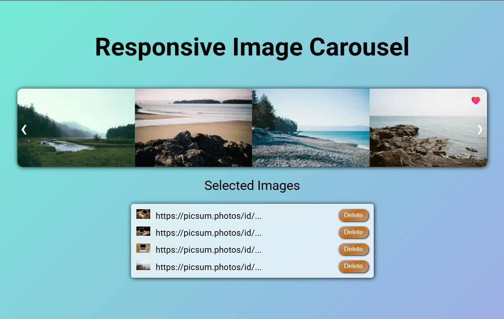

# Image Carousel Project

## Description
This is an **Image Carousel** built with Vue 3, allowing users to select images and add them to their favorites.

## Live Site
🌐 [View the Carousel here](https://rss-777.github.io/carousel_frontco/)

## Features
- Infinite **scrolling** with **prev/next** buttons (each click scrolls exactly one image).  
- **Responsive layout:** number of visible images adjusts according to the screen width.  
- **Image selection:** clicking an image adds it to the selected list.  
- **Selected images list** is displayed below the carousel.  
- Smooth **animations** for both the carousel and the selected images list.

## Technologies Used
- **Vue 3**  
- **Pinia** for managing the state of selected images  
- **Vite** for project bundling  

## Screenshots

    
    

